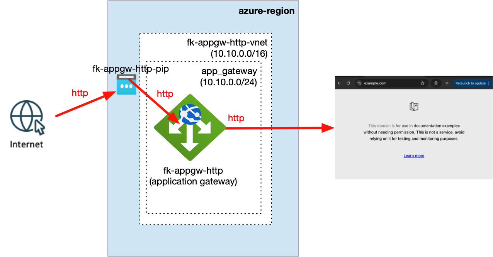
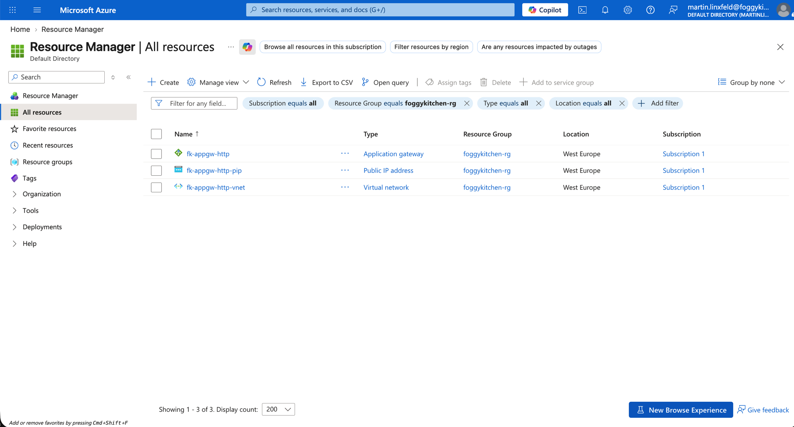
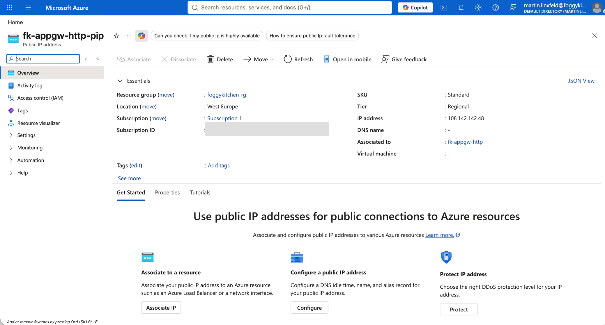
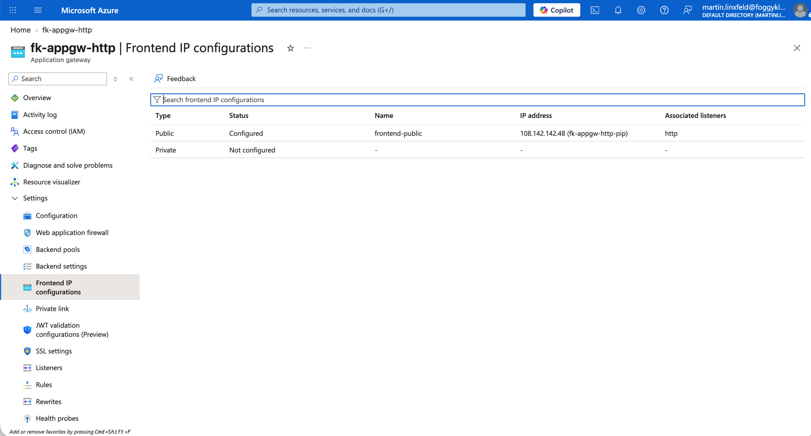
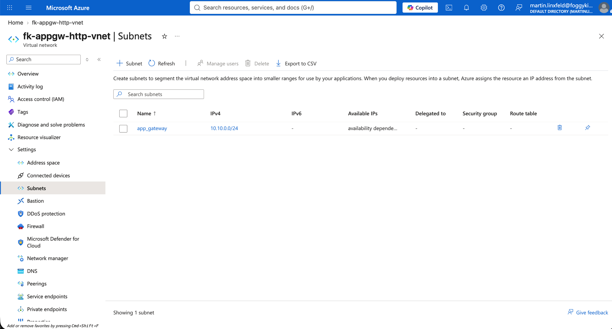
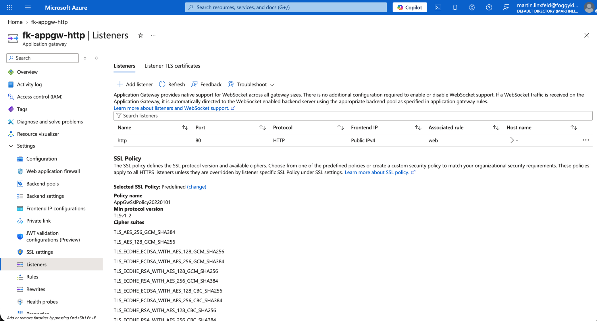
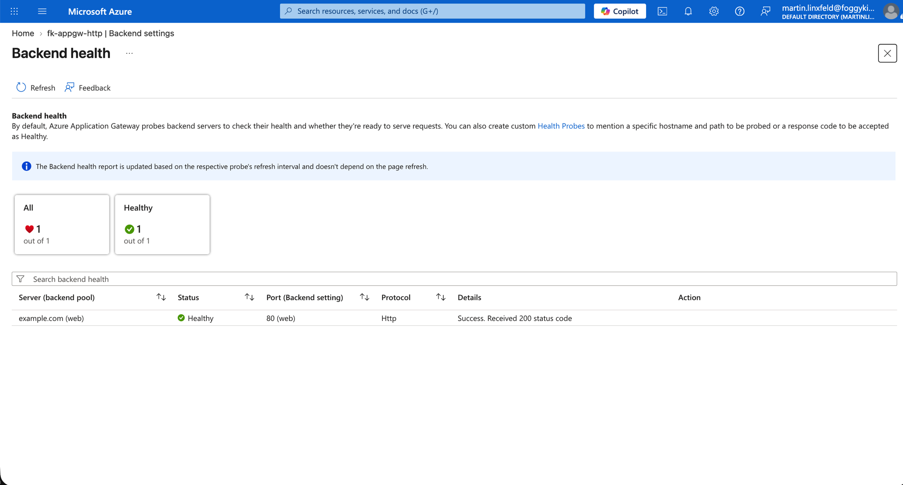

# Example 01: Public HTTP Backend (Application Gateway Basics)

In this first Application Gateway example, we deploy a **Standard_v2 Azure Application Gateway** with a
**public HTTP listener** and an external HTTP backend using **Terraform / OpenTofu**.

This example introduces the basic Application Gateway request path and is intentionally kept simple:
no TLS termination, no WAF policy, and no private frontend.
Its purpose is to establish a **clean, understandable baseline** for public HTTP routing.

---

## 🧭 Architecture Overview

The example creates its own resource group, VNet, dedicated Application Gateway subnet, and Standard public IP.
Requests arrive on TCP port 80 and are forwarded over HTTP to `example.com`.



*Figure 1. Public HTTP traffic flow through the Standard_v2 Application Gateway to the external `example.com` backend.*

This example creates:

- An Azure Resource Group
- A Virtual Network with address space `10.10.0.0/16`
- A dedicated Application Gateway subnet using `10.10.0.0/24`
- A Standard, regional Public IP address
- A Standard_v2 Application Gateway
- A public HTTP listener on port 80
- A backend pool targeting `example.com`
- A custom HTTP health probe
- A basic request-routing rule

This is a **learning-focused HTTP baseline**, not a production-ready ingress configuration.

---

## 🎯 Why this example exists

Before introducing:

- HTTPS listeners and Key Vault certificates,
- Web Application Firewall policies,
- private frontends,
- or advanced routing,

it is critical to understand **how the public frontend, listener, routing rule, backend setting, backend pool, and health probe work together**.

This example focuses on:

- Public frontend configuration
- Basic HTTP request routing
- Dedicated subnet placement
- Backend health verification
- Composition of focused FoggyKitchen modules

---

## 🚀 Deployment Steps

```bash
tofu init
tofu plan -var-file=/path/to/terraform.tfvars
tofu apply -var-file=/path/to/terraform.tfvars
```

The variables file must provide `resource_group_name`. The Azure region defaults to `westeurope`.

---

## 🖼️ Azure Portal View



*Figure 2. Azure resources created by the example in the `foggykitchen-rg` resource group.*



*Figure 3. Standard public IP address assigned to `fk-appgw-http`.*



*Figure 4. Public frontend IP configuration and its association with the HTTP listener.*



*Figure 5. Dedicated `app_gateway` subnet used by the Application Gateway.*



*Figure 6. Public HTTP listener on port 80 associated with the `web` routing rule.*



*Figure 7. Healthy `example.com` backend responding with HTTP status code 200.*

---

## 🧹 Cleanup

The Application Gateway is a billable Azure service. Destroy the example when it is no longer needed:

```bash
tofu destroy -var-file=/path/to/terraform.tfvars
```

---

## 🪪 License

Licensed under the **Universal Permissive License (UPL), Version 1.0**.
See [LICENSE](../../LICENSE) for details.

© 2026 [FoggyKitchen.com](https://foggykitchen.com) - Cloud. Code. Clarity.
