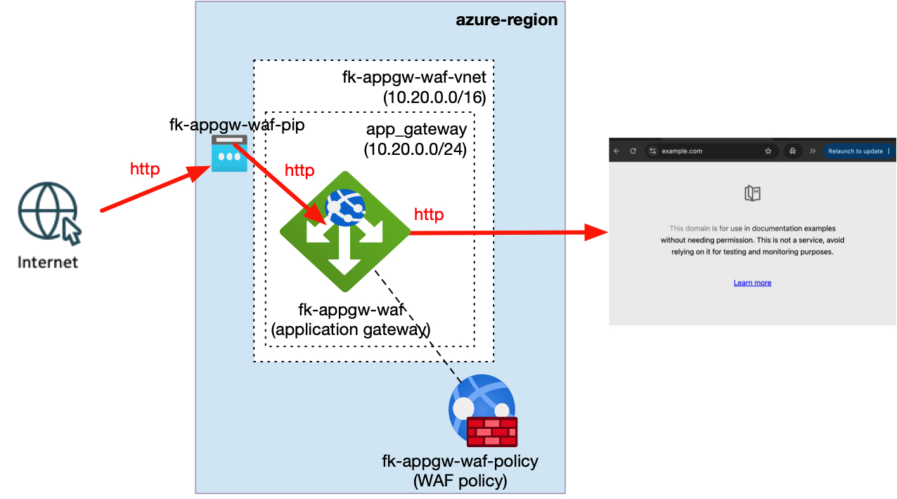
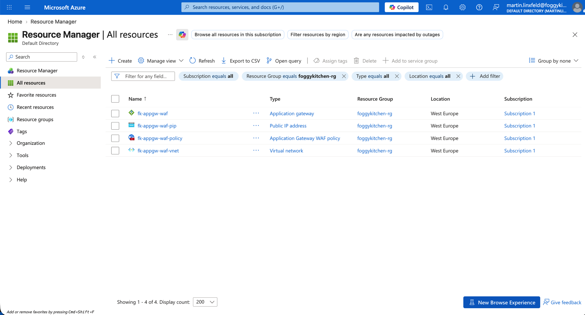
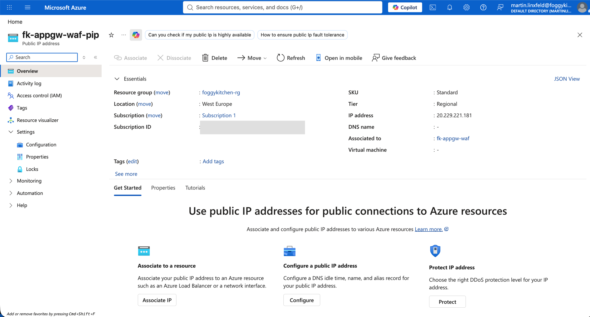
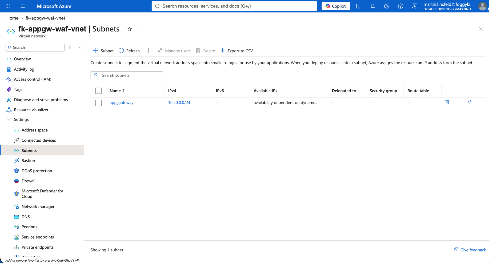
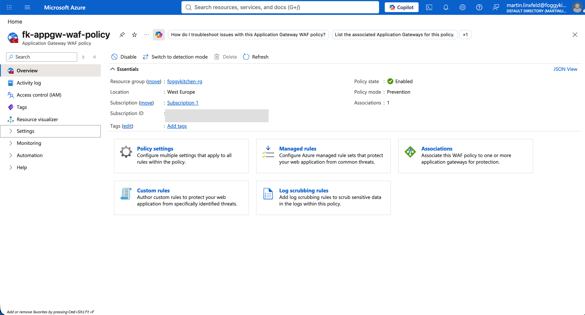
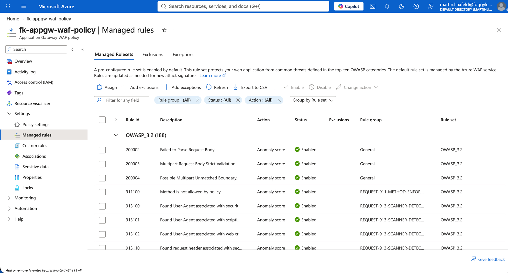
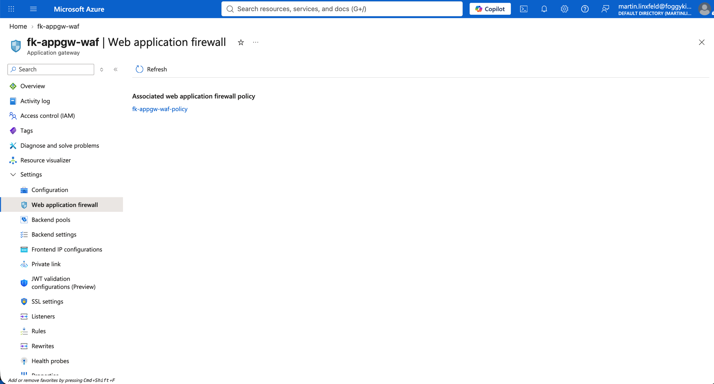
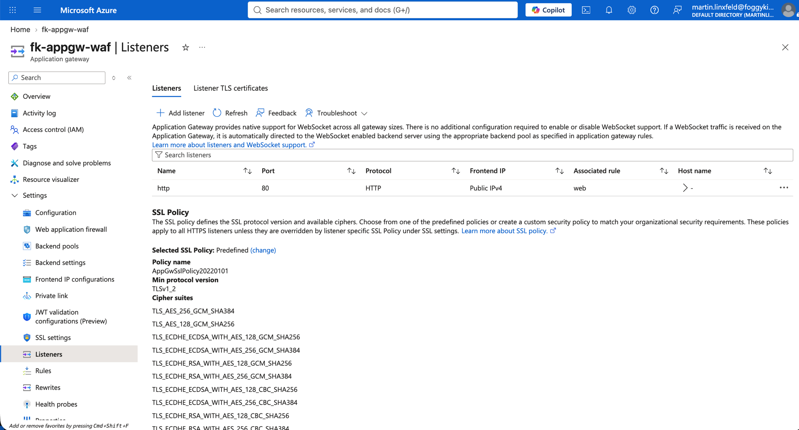

# Example 02: WAF_v2 with Policy (Application Gateway Security)

In this example, we deploy a **WAF_v2 Azure Application Gateway** and attach an
**Azure Web Application Firewall Policy** using **Terraform / OpenTofu**.

This example extends the basic HTTP request path with managed OWASP protection.
It focuses on the relationship between the gateway, WAF policy, listener, routing rule, and backend health probe.

---

## 🧭 Architecture Overview

The example creates its own resource group, VNet, dedicated Application Gateway subnet, Standard public IP,
and a temporary example-owned WAF policy in Prevention mode.
HTTP requests received on port 80 are evaluated by the WAF policy before being routed to `example.com`.



*Figure 1. Public HTTP traffic flow through the WAF_v2 Application Gateway, with the WAF Policy attached as a regional policy outside the VNet.*

This example creates:

- An Azure Resource Group
- A Virtual Network with address space `10.20.0.0/16`
- A dedicated Application Gateway subnet using `10.20.0.0/24`
- A Standard, regional Public IP address
- A WAF_v2 Application Gateway
- An Azure Web Application Firewall Policy
- An OWASP 3.2 managed rule set
- A public HTTP listener on port 80
- A backend pool targeting `example.com`
- A custom HTTP health probe
- A basic request-routing rule

This is a **WAF composition example**, not a complete production security policy.

---

## 🎯 Why this example exists

Before introducing:

- custom WAF exclusions,
- custom rules,
- HTTPS listeners,
- or centralized security policy management,

it is critical to understand **how an Application Gateway consumes an independently managed WAF policy**.

This example focuses on:

- WAF_v2 gateway configuration
- WAF policy association
- OWASP managed rules in Prevention mode
- Separation between gateway and policy lifecycle
- Backend health verification against an external FQDN
- Composition of the VNet and Public IP FoggyKitchen modules

---

## 🚀 Deployment Steps

```bash
tofu init
tofu plan -var-file=/path/to/terraform.tfvars
tofu apply -var-file=/path/to/terraform.tfvars
```

The variables file must provide `resource_group_name`. The Azure region defaults to `westeurope`.

---

## 🖼️ Azure Portal View



*Figure 2. Azure resources created by the example in the `foggykitchen-rg` resource group.*



*Figure 3. Standard public IP address assigned to the `fk-appgw-waf` Application Gateway.*



*Figure 4. Dedicated `app_gateway` subnet used by the Application Gateway.*



*Figure 5. Enabled WAF policy operating in Prevention mode and associated with one Application Gateway.*



*Figure 6. OWASP 3.2 managed rule set enabled in the WAF policy.*



*Figure 7. `fk-appgw-waf-policy` associated with the `fk-appgw-waf` Application Gateway.*



*Figure 8. Public HTTP listener on port 80 associated with the `web` routing rule.*

---

## ✅ Test Results

The public listener returned HTTP status code 200:

```console
$ curl -I http://$(tofu output -raw public_ip_address)
HTTP/1.1 200 OK
```

The Application Gateway health probe reported the external backend as healthy:

```console
$ az network application-gateway show-backend-health \
    --resource-group foggykitchen-rg \
    --name fk-appgw-waf \
    --query 'backendAddressPools[].backendHttpSettingsCollection[].servers[].{address:address,health:health}' \
    --output table
Address      Health
-----------  --------
example.com  Healthy
```

---

## 🧹 Cleanup

The Application Gateway is a billable Azure service. Destroy the example when it is no longer needed:

```bash
tofu destroy -var-file=/path/to/terraform.tfvars
```

---

## 🪪 License

Licensed under the **Universal Permissive License (UPL), Version 1.0**.
See [LICENSE](../../LICENSE) for details.

© 2026 [FoggyKitchen.com](https://foggykitchen.com) - Cloud. Code. Clarity.
