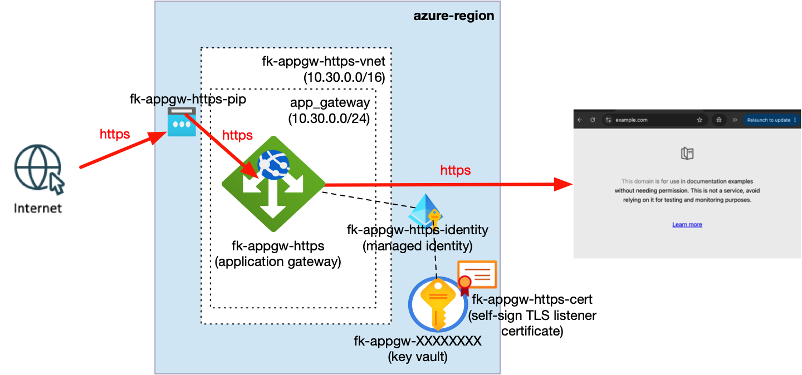
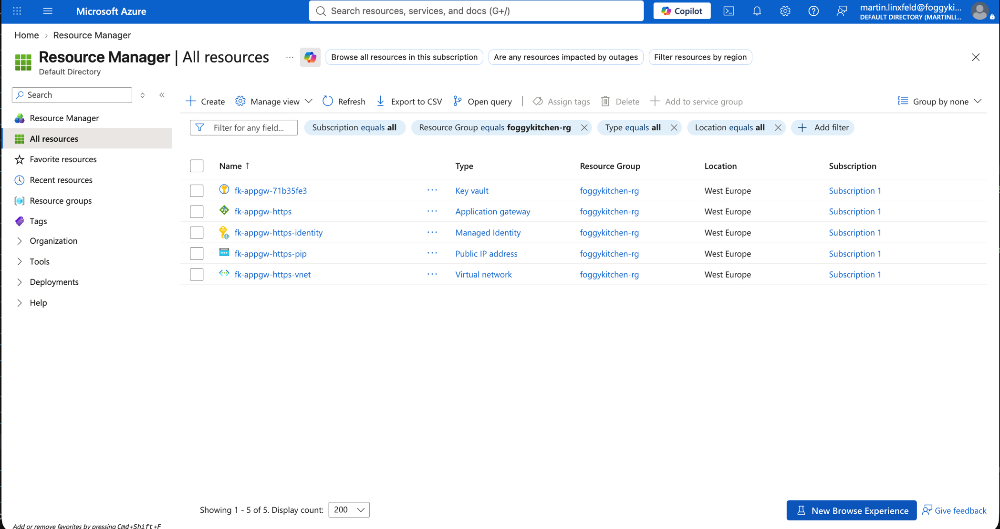
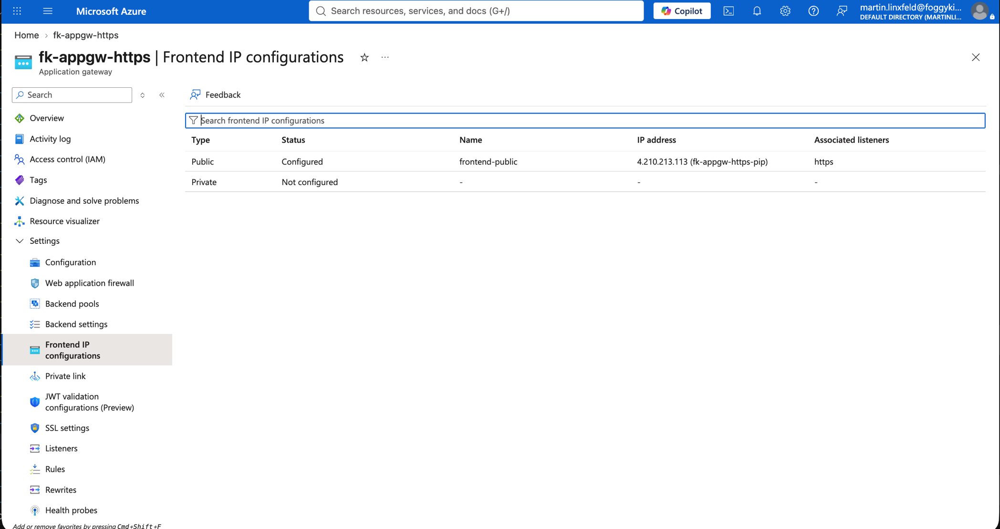
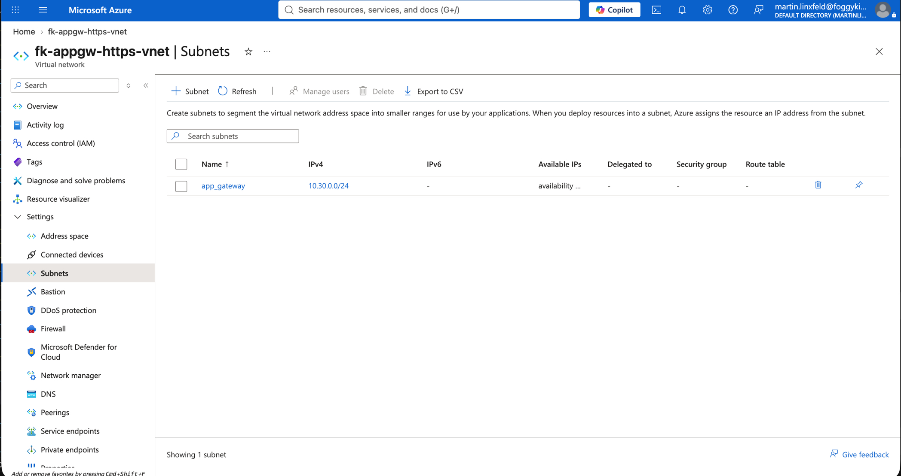
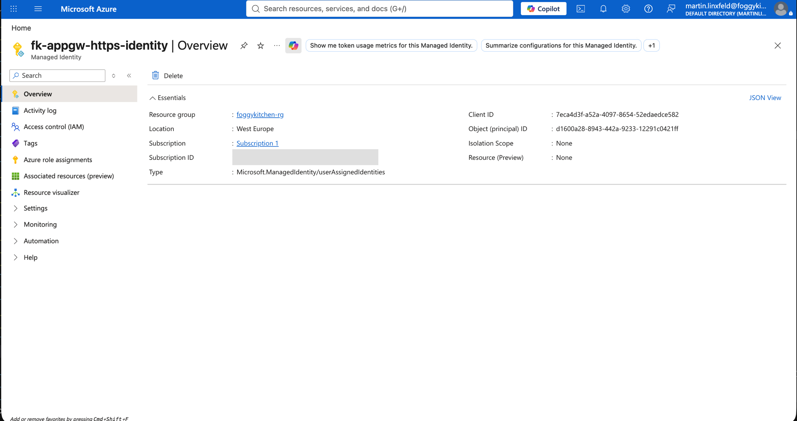
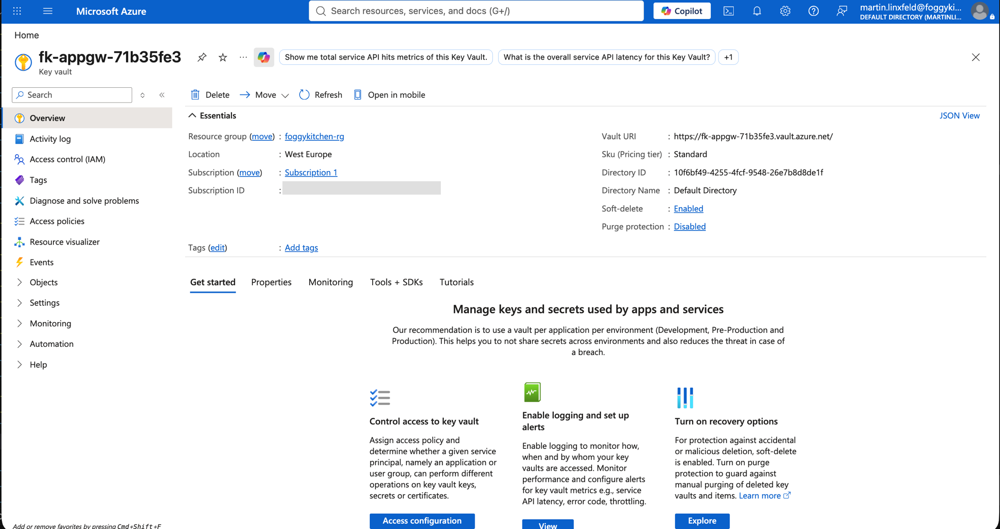
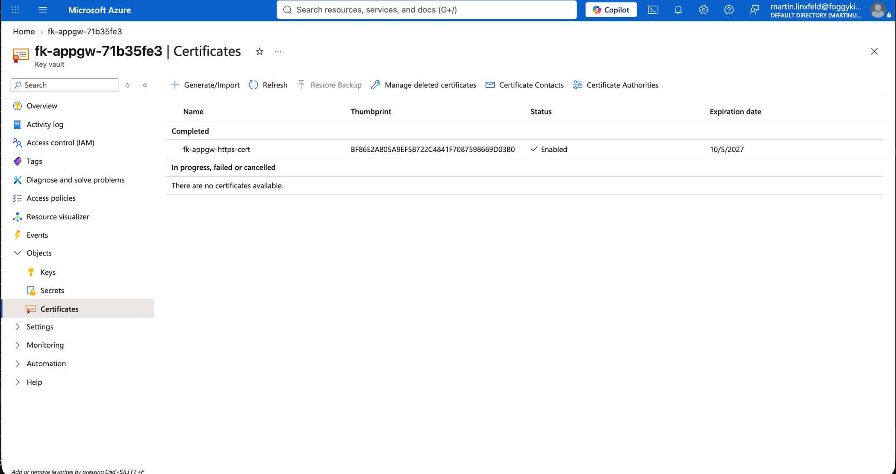
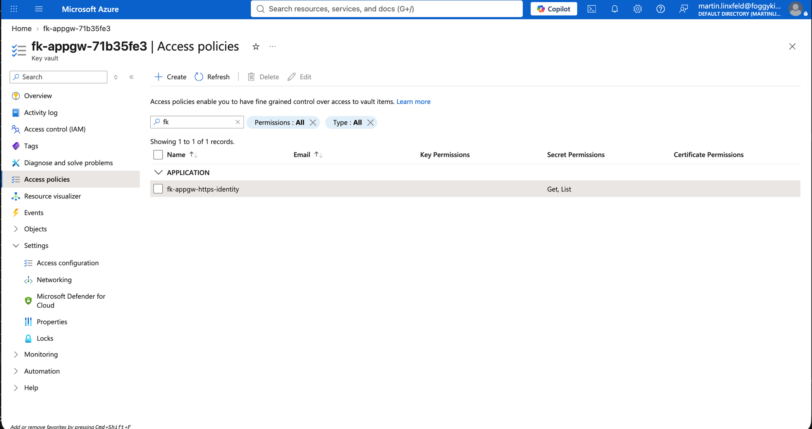
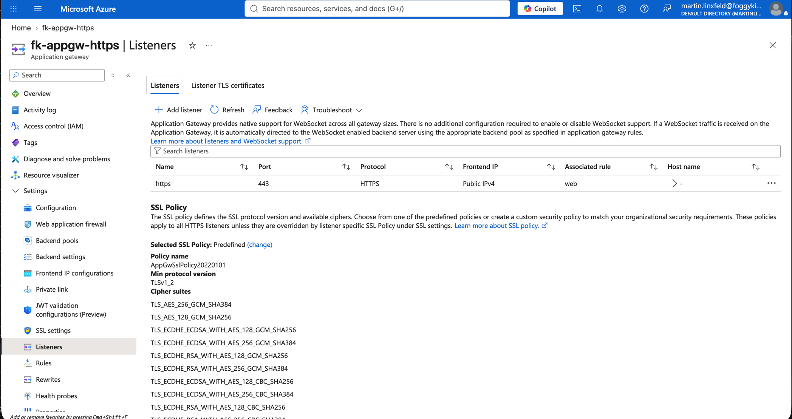

# Example 03: HTTPS Listener with Key Vault Certificate

In this example, we deploy a **Standard_v2 Azure Application Gateway** with an
**HTTPS listener backed by an Azure Key Vault certificate** using **Terraform / OpenTofu**.

This example extends the basic request path with TLS termination, a user-assigned managed identity,
and a self-signed certificate stored in Azure Key Vault.

---

## 🧭 Architecture Overview

The example creates its own resource group, VNet, dedicated Application Gateway subnet, Standard public IP,
user-assigned managed identity, Key Vault, and self-signed certificate.
The gateway retrieves the listener certificate from Key Vault through the managed identity.
Requests arrive over HTTPS on port 443 and are forwarded to `example.com` over HTTPS.



*Figure 1. End-to-end HTTPS traffic flow through the Standard_v2 Application Gateway, using a user-assigned managed identity to access the self-signed TLS listener certificate stored in Azure Key Vault.*

This example creates:

- An Azure Resource Group
- A Virtual Network with address space `10.30.0.0/16`
- A dedicated Application Gateway subnet using `10.30.0.0/24`
- A Standard, regional Public IP address
- A user-assigned managed identity
- An Azure Key Vault with access policies
- A self-signed certificate for the listener
- A Standard_v2 Application Gateway
- A public HTTPS listener on port 443
- An SSL certificate reference backed by Key Vault
- A backend pool targeting `example.com`
- A custom HTTPS health probe
- A basic request-routing rule

The self-signed certificate is suitable for demonstrating Key Vault integration, not for production traffic.

---

## 🎯 Why this example exists

Before introducing:

- end-to-end certificate validation controls,
- multiple HTTPS sites,
- certificate rotation workflows,
- or WAF-protected HTTPS ingress,

it is critical to understand **how Application Gateway uses managed identity to retrieve a certificate from Azure Key Vault**.

This example focuses on:

- HTTPS listener configuration
- Key Vault certificate references
- User-assigned managed identity integration
- Composition of focused VNet, Public IP, managed identity, and Key Vault modules
- TLS termination at Application Gateway
- HTTPS health probing and backend forwarding

---

## 🚀 Deployment Steps

```bash
tofu init
tofu plan -var-file=/path/to/terraform.tfvars
tofu apply -var-file=/path/to/terraform.tfvars
```

The variables file must provide `resource_group_name`. The Azure region defaults to `westeurope`.

---

## 🖼️ Azure Portal View



*Figure 2. Azure resources created by the example in the `foggykitchen-rg` resource group.*



*Figure 3. Public frontend IP configuration associated with the `https` listener on `fk-appgw-https`.*



*Figure 4. Dedicated `app_gateway` subnet using `10.30.0.0/24` for the Application Gateway.*



*Figure 5. User-assigned managed identity used by Application Gateway to authenticate to Azure Key Vault.*



*Figure 6. Azure Key Vault containing the self-signed TLS listener certificate.*



*Figure 7. Enabled `fk-appgw-https-cert` certificate stored in Azure Key Vault.*



*Figure 8. Key Vault access policy granting the Application Gateway managed identity `Get` and `List` permissions for secrets.*



*Figure 9. Public HTTPS listener on port 443 associated with the `web` routing rule.*

---

## ✅ Test Results

Because the listener uses a self-signed certificate, the HTTPS request uses `-k` to skip local certificate trust validation.
The gateway returned HTTP status code 200 over HTTP/2:

```console
$ curl -k -I https://$(tofu output -raw public_ip_address)
HTTP/2 200
```

The Application Gateway HTTPS health probe reported the external backend as healthy:

```console
$ az network application-gateway show-backend-health \
    --resource-group foggykitchen-rg \
    --name fk-appgw-https \
    --query 'backendAddressPools[].backendHttpSettingsCollection[].servers[].{address:address,health:health}' \
    --output table
Address      Health
-----------  --------
example.com  Healthy
```

The deployed gateway reached the `Succeeded` state with the user-assigned identity, HTTPS listener,
and versionless Key Vault secret reference configured correctly:

```console
$ az network application-gateway show \
    --resource-group foggykitchen-rg \
    --name fk-appgw-https \
    --query '{state:provisioningState,sku:sku.name,identityType:identity.type,listenerProtocol:httpListeners[0].protocol,sslCertificateName:sslCertificates[0].name,keyVaultSecretId:sslCertificates[0].keyVaultSecretId}' \
    --output json
{
  "identityType": "userAssigned",
  "keyVaultSecretId": "https://fk-appgw-71b35fe3.vault.azure.net/secrets/fk-appgw-https-cert",
  "listenerProtocol": "Https",
  "sku": "Standard_v2",
  "sslCertificateName": "site",
  "state": "Succeeded"
}
```

---

## 🧹 Cleanup

The Application Gateway is a billable Azure service. Destroy the example when it is no longer needed:

```bash
tofu destroy -var-file=/path/to/terraform.tfvars
```

---

## 🪪 License

Licensed under the **Universal Permissive License (UPL), Version 1.0**.
See [LICENSE](../../LICENSE) for details.

© 2026 [FoggyKitchen.com](https://foggykitchen.com) - Cloud. Code. Clarity.
